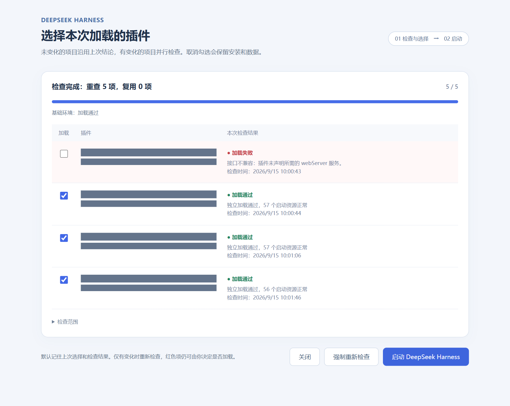
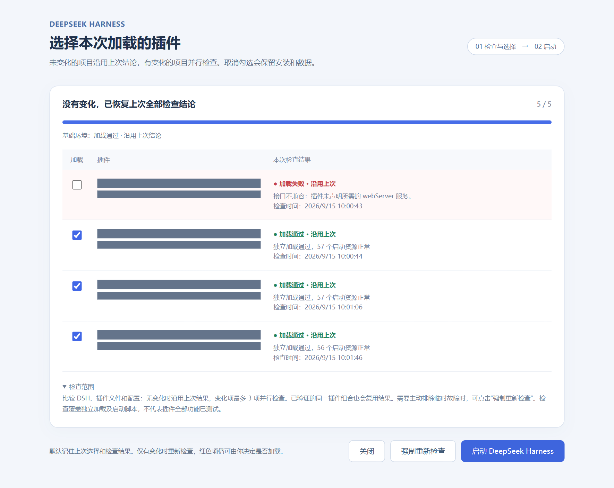

# Sental DSH Preflight

[简体中文](README.md) | **English**

**Check your plugins before starting DeepSeek Harness.**

A two-stage Windows launcher for DeepSeek Harness. If a plugin fails to load after a DSH or plugin update, review the results in a separate window, deselect the failing extension, and start DSH with your chosen plugins.

**All results in one view · Plugin selection · Up to 3 checks in parallel · Recheck only what changed · Remember your selection**

[Quick start](#quick-start) · [How it works](#how-it-works) · [Caching](#caching) · [FAQ](#faq) · [Configuration and recovery](docs/guide.en.md)

The launcher interface is currently in Chinese. This guide includes the Chinese button labels used in the screenshots.

## Preview

### See what failed, then choose what to load

Results appear together in one list. Red rows show loading failures and their causes. Checkboxes control which plugins to load; deselecting a plugin preserves its installation and data.



### Reuse results when nothing changed

Reopening the launcher restores saved results with their original check times. Changes to DSH, plugins, or relevant configuration trigger checks for affected items.



## How it works

| Step | What you see | What to do |
| --- | --- | --- |
| **1 · Check** | Base environment and plugin results; changed items checked in parallel | Wait for the full scan to finish |
| **2 · Select** | Green for passed, red for failed, yellow for undetermined | Select the plugins to load and temporarily disable problematic extensions |
| **3 · Launch** | Validation of the selected plugin combination | Click **启动 DeepSeek Harness** (Start DeepSeek Harness) |

Individual checks report multiple problems together. Before starting DSH, the launcher also validates the selected plugins as a combination. Your selection is saved when you click Start and restored next time.

## Quick start

### 1. Prepare your environment

| Component | Requirement |
| --- | --- |
| System | Windows 10/11 with Windows PowerShell 5.1 |
| Node.js | Version 22 or later, also meeting your DSH version's requirements; `node.exe` and `npm.cmd` available in your terminal |
| DSH | A built [DeepSeek Harness source checkout](https://github.com/deepseek-ai/deepseek-harness) containing `apps/cli/lib/bin.js` |
| Data directory | An initialized `web` profile, usually at `%USERPROFILE%\.dsh\profiles\web` |
| Browser | Edge for a standalone app window; otherwise your default browser |

This version supports **DSH Web mode from a source checkout**, using `127.0.0.1:3080` for the main service. It is a community tool installed and run separately from the official Electron client.

### 2. Download and install

Download and extract this repository using **Code → Download ZIP**, or clone it with Git. Keep the launcher in a writable, permanent directory. Open PowerShell in that directory and run:

```powershell
powershell.exe -NoProfile -ExecutionPolicy Bypass -File .\Install-Launcher.ps1 -RepositoryPath "C:\Projects\deepseek-harness"
```

Replace the example path with your DSH source directory. The installer validates the environment, installs locked dependency versions, and creates a **Sental DSH Preflight** desktop shortcut. Installation does not start DSH or change its profile.

<details>
<summary>Custom data directory and alternative launch methods</summary>

To specify your DSH data directory:

```powershell
powershell.exe -NoProfile -ExecutionPolicy Bypass -File .\Install-Launcher.ps1 -RepositoryPath "C:\Projects\deepseek-harness" -DshHome "D:\DSHData"
```

Add `-NoShortcut` to save configuration without creating a shortcut, then double-click `Launch-DSH.vbs`. If VBScript is disabled, run:

```powershell
powershell.exe -NoProfile -ExecutionPolicy Bypass -File .\Launch-DSH.ps1
```

</details>

### 3. Open the desktop shortcut

Double-click **Sental DSH Preflight**, wait for the checks, adjust the selection, and click **启动 DeepSeek Harness**.

The first scan actually loads the plugins, so its duration depends on their number and startup time. Subsequent scans reuse results for unchanged items.

## Caching

| Change | Behavior |
| --- | --- |
| No changes to DSH, plugins, or relevant configuration | Restore previous results and check times |
| One external plugin or its dependency files change | Recheck affected items |
| DSH runtime files or checking logic change | Recheck all items |
| Only the selection changes | Keep individual results; validate the selected combination before launch |
| The same combination already passed and relevant files are unchanged | Reuse combination results, then check the main service's health |
| Click **强制重新检查** (Force recheck) | Ignore saved conclusions and run checks again |

Passed, failed, and undetermined results are all cached. Network conditions, credentials, and external service availability cannot be detected through file changes; use **强制重新检查** after those conditions change. Changes to arbitrary external scripts or services used by manually inserted extensions also call for a forced recheck.

## What the checks cover

- **Selectable items:** external plugin bundles in the Web profile and direct insertions with an `id` and `name` in user patches. Core components remain enabled; nested plugin groups do not have individual switches.
- **Actual loading:** temporary DSH data directories, working directories, and ports are used to check isolated loading, pages, and startup assets. Checks can reveal missing resources, interfaces, and dependency declarations.
- **Combination validation:** some plugins require other plugins, real credentials, or a specific working directory. Interpret individual failures alongside combination checks and actual operation.
- **Startup recovery:** reuse healthy instances and attempt recovery at most once. If another program owns the port, leave it running and report the conflict.

A passed result covers loading and resource checks, not every plugin feature. Checks execute plugin code, so only check plugins you trust. See the [security notes](SECURITY.md).

## FAQ

### Does deselecting a plugin uninstall it?

No. It changes the loading selection while keeping the installation and data. You can enable it again later.

### Can I select a red plugin?

Yes. A plugin may lack dependencies when loaded alone but work in combination. The selected combination must pass validation before DSH starts.

### Can I toggle plugins instantly while DSH is running?

This tool provides selection before startup. Changing the selection may restart DSH, so finish active tasks before switching plugins.

### What if the base environment check fails?

Read the error and check logs, and confirm that DSH is built and the data directory is correct. The launcher helps locate loading problems but does not automatically repair DSH or roll back versions. See [file locations](docs/guide.en.md#file-locations).

### How do I restore the original configuration or stop using the launcher?

See [restore the original loading list](docs/guide.en.md#restore-the-original-loading-list) and [stop using the launcher](docs/guide.en.md#stop-using-the-launcher).

## Development and validation

```powershell
npm.cmd ci --ignore-scripts
npm.cmd test
npm.cmd run test:runtime
npm.cmd run test:install
npm.cmd run test:process
```

Tests use temporary fixtures and do not depend on the maintainer's DSH installation. Windows service tests cover result aggregation, cache reuse, and rechecking a changed plugin. Installer tests cover paths, shortcuts, and configuration preservation; process tests cover child-process cleanup. GitHub Actions runs tests on Windows with Node.js 22 and 24.

The integration baseline is the DSH `0.1.5-rc.1` source Web startup interface. When reporting an issue, include DSH and Node.js versions, reproduction steps, and error excerpts with sensitive information removed.

## License

This project is licensed under the [MIT License](LICENSE). DeepSeek Harness and npm dependencies retain their own licenses; see [third-party notices](THIRD_PARTY_NOTICES.md).
